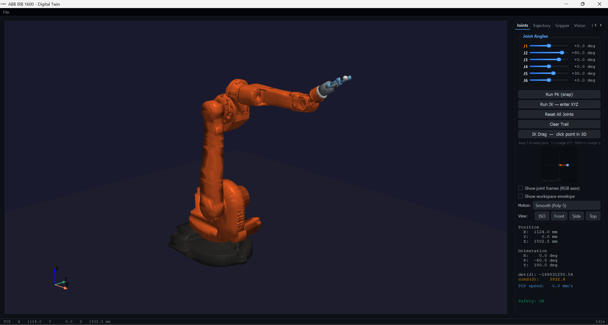
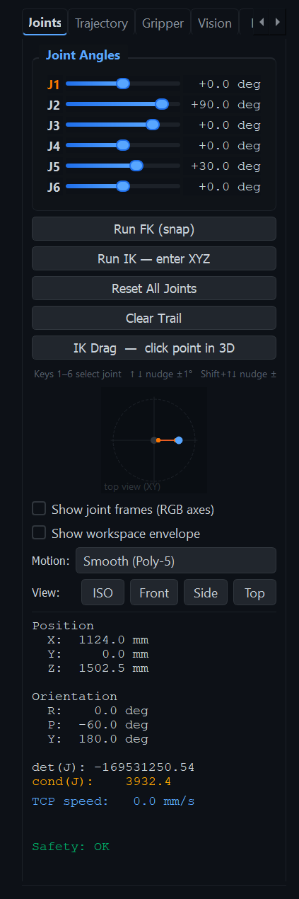
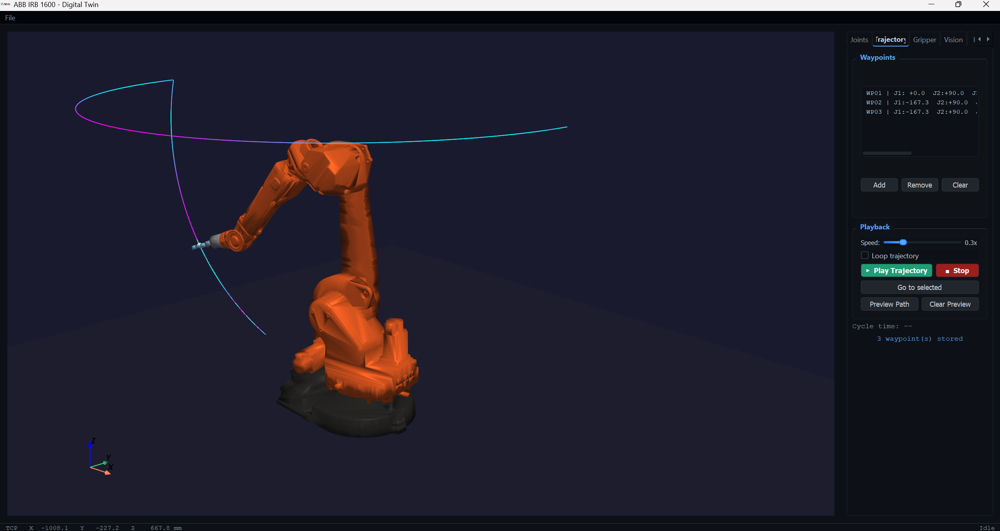
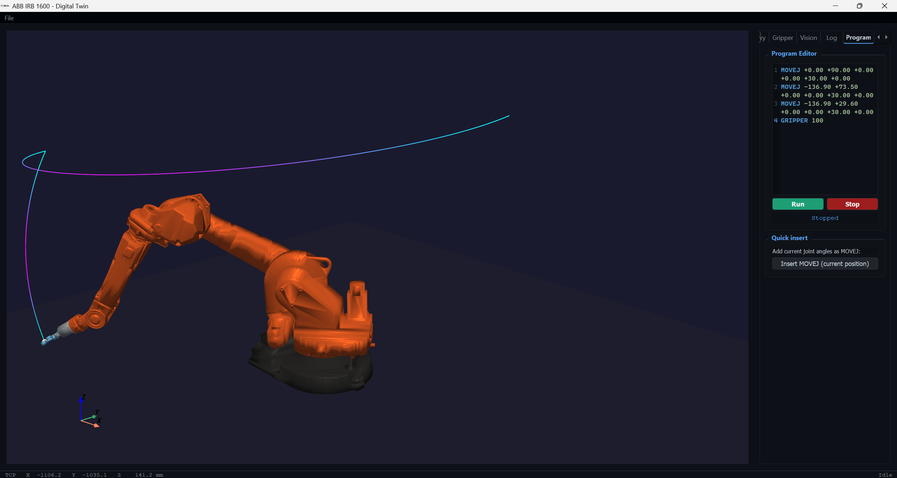
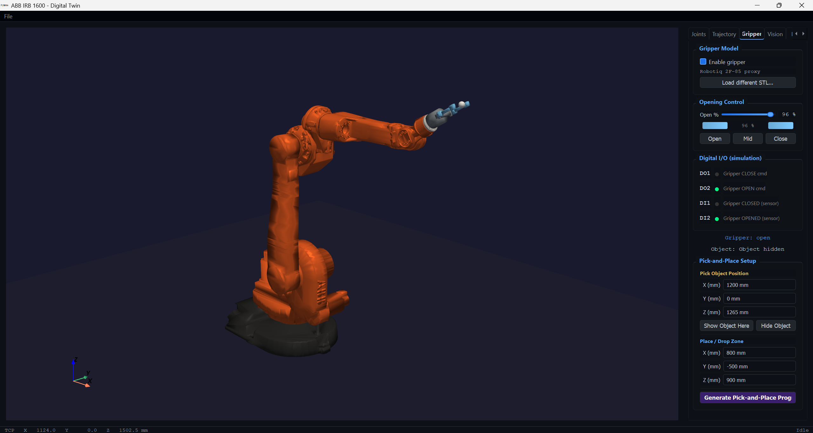
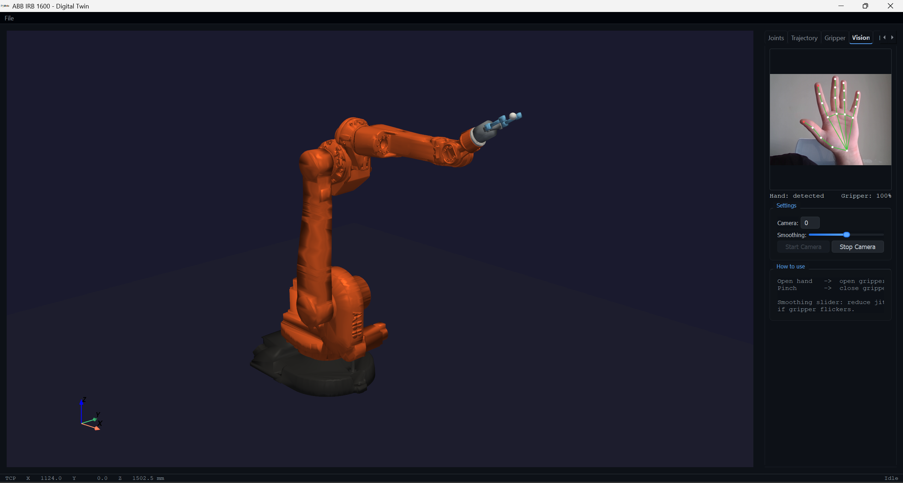
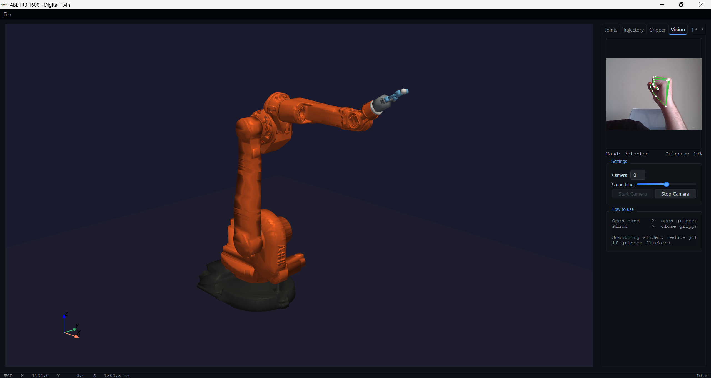

<div align="center">



<br/>
<br/>

# ABB IRB 1600 Digital Twin

**Real-time 3D digital twin of the ABB IRB 1600-6/1.45 industrial robot**

<br/>

[](https://python.org)
[](https://mathworks.com)
[](https://microsoft.com)
[](https://pyvista.org)
[](https://mediapipe.dev)
[](LICENSE)

<br/>

*Drive a 6-axis industrial robot through sliders · IK drag · hand gestures · trajectory playback · a built-in scripting language — all in real time, no hardware required.*

</div>

---

## Table of Contents

- [Demos](#demos)
- [Features](#features)
- [Tech Stack](#tech-stack)
- [Kinematics](#kinematics)
- [Getting Started](#getting-started)
- [Project Structure](#project-structure)
- [Usage Guide](#usage-guide)
- [Joint Limits](#joint-limits)
- [License](#license)

---

## Demos

<table>
  <tr>
    <td align="center" width="33%">
      
      <br/><br/><b>Pick-and-Place</b>
      <br/><sub>Auto-generated IK program from pick/drop coordinates</sub>
    </td>
    <td align="center" width="33%">
      
      <br/><br/><b>Trajectory Playback</b>
      <br/><sub>Multi-waypoint recording with speed-colored TCP trail</sub>
    </td>
    <td align="center" width="33%">
      
      <br/><br/><b>Hand Gesture Control</b>
      <br/><sub>Pinch to close · open hand to release</sub>
    </td>
  </tr>
</table>

---

## Features

### Kinematics & Motion
- MATLAB-powered FK/IK engine with standard DH parameters
- 6-axis joint sliders + keyboard nudge (`1`–`6`, `↑↓`, `Shift` ±5°)
- **IK Drag** — click any point in the 3D viewport to move the TCP
- Motion profiles: Poly-5, Trapezoidal, S-curve
- Multi-start numerical IK solver (`lsqnonlin`)

### Trajectory & Programming
- Record waypoints → preview path → play back at adjustable speed
- Built-in scripting language: `HOME`, `MOVEJ`, `GRIPPER`, `WAIT`
- Syntax highlighting and one-click pose capture
- Pick-and-place program auto-generator

### 3D Visualization
- Real-time animated STL meshes for all 6 links
- Robotiq 2F-85 gripper with animated fingers
- Speed-colored TCP spline trail

### Gripper & Vision
- Gripper slider + Open / Mid / Close quick buttons
- Digital I/O LED indicators
- MediaPipe hand tracking: pinch → close, open hand → open
- Adjustable smoothing to reduce jitter

### Safety & Logging
- Joint-limit checking and singularity detection
- Ground clearance and self-collision warnings
- Time-stamped motion log with CSV export

---

## Screenshots

<table>
  <tr>
    <td align="center"><br/><br/><sub>Joint Control</sub></td>
    <td align="center"><br/><br/><sub>Trajectory Playback</sub></td>
    <td align="center"><br/><br/><sub>Program Editor</sub></td>
  </tr>
  <tr>
    <td align="center"><br/><br/><sub>Gripper Control</sub></td>
    <td align="center"><br/><br/><sub>Open Hand → Gripper Open</sub></td>
    <td align="center"><br/><br/><sub>Pinch → Gripper Closed</sub></td>
  </tr>
</table>

---

## Tech Stack

| Layer | Technology |
|:------|:-----------|
| Robot Kinematics | MATLAB Engine API + DH-parameter `.m` files |
| IK Solver | MATLAB `lsqnonlin` (12-element residual, multi-start) |
| 3D Visualization | PyVista + VTK (`BackgroundPlotter`) |
| GUI Framework | PyQt5 |
| Hand Tracking | MediaPipe Tasks (`HandLandmarker`) |
| Camera Capture | OpenCV |
| Numerics | NumPy |

---

## Kinematics

<details>
<summary><b>Denavit-Hartenberg Parameters</b></summary>
<br/>

The robot is modelled with the **standard DH convention** (Rot_z → Trans_z → Trans_x → Rot_x).  
θᵢ is the joint variable; all other columns are fixed link parameters.

| Joint | a (mm) | α | d (mm) | θ |
|:-----:|-------:|:---------:|-------:|:-:|
| 1 | 150 | +90° | 486 | θ₁ |
| 2 | 700 | 0° | 0 | θ₂ |
| 3 | 115 | +90° | 0 | θ₃ |
| 4 | 0 | −90° | 625 | θ₄ |
| 5 | 0 | +90° | 0 | θ₅ |
| 6 | 0 | 0° | 100 | θ₆ |

*Reference: ABB IRB 1600 Product Specification — 3HAC027340-001*

</details>

<details>
<summary><b>DH Transformation Matrix</b></summary>
<br/>

Each joint produces a 4×4 homogeneous transformation matrix:

$$
{}^{i-1}A_i(\theta_i) =
\begin{bmatrix}
\cos\theta_i & -\sin\theta_i\cos\alpha_i &  \sin\theta_i\sin\alpha_i & a_i\cos\theta_i \\
\sin\theta_i &  \cos\theta_i\cos\alpha_i & -\cos\theta_i\sin\alpha_i & a_i\sin\theta_i \\
0 & \sin\alpha_i & \cos\alpha_i & d_i \\
0 & 0 & 0 & 1
\end{bmatrix}
$$

</details>

<details>
<summary><b>Forward Kinematics</b></summary>
<br/>

The base-to-end-effector transform is the chained product of all six matrices:

$$
T(\mathbf{q}) = {}^0A_1(\theta_1)\; {}^1A_2(\theta_2)\; {}^2A_3(\theta_3)\; {}^3A_4(\theta_4)\; {}^4A_5(\theta_5)\; {}^5A_6(\theta_6)
$$

The upper-left 3×3 block of **T** is the rotation matrix **R** and the last column gives the TCP position **p** = [x, y, z]ᵀ (in mm).

</details>

<details>
<summary><b>Inverse Kinematics</b></summary>
<br/>

IK is solved numerically with MATLAB's `lsqnonlin` using a **12-element residual**:

$$
\mathbf{r}(\mathbf{q}) =
\begin{bmatrix}
\mathbf{p}(\mathbf{q}) - \mathbf{p}_{\text{des}} \\
\lambda\,\bigl(\mathbf{R}(\mathbf{q})_{:} - \mathbf{R}_{\text{des}_{:}}\bigr)
\end{bmatrix}
\in \mathbb{R}^{12}
$$

where $\mathbf{p}(\mathbf{q}) \in \mathbb{R}^3$ is the position error (mm), $\mathbf{R}_{:}$ denotes the vectorised 3×3 rotation matrix (9 elements), and $\lambda = 500$ balances the mm/dimensionless unit mismatch.

**Multi-start strategy:** if the residual norm exceeds 10⁻⁶ after the initial guess, up to 10 random restarts are attempted (uniform sampling within joint limits) and the best solution is kept.

</details>

<details>
<summary><b>Jacobian</b></summary>
<br/>

The 6×6 geometric Jacobian relates joint velocities to end-effector twist $[\mathbf{v};\,\boldsymbol{\omega}]$:

$$
\begin{bmatrix} \mathbf{v} \\ \boldsymbol{\omega} \end{bmatrix} = J(\mathbf{q})\,\dot{\mathbf{q}}, \qquad J \in \mathbb{R}^{6 \times 6}
$$

Each column is computed as:

$$
J_i =
\begin{bmatrix}
\dfrac{\partial \mathbf{p}}{\partial q_i} \\
\mathbf{z}_{i-1}
\end{bmatrix}
$$

- **Linear part** $\partial\mathbf{p}/\partial q_i$ — numerical central difference with perturbation $\varepsilon = 10^{-7}$ rad
- **Angular part** $\mathbf{z}_{i-1}$ — z-axis of frame $i-1$, extracted from the partial FK product ${}^0A_1 \cdots {}^{i-2}A_{i-1}$

</details>

---

## Getting Started

### Prerequisites

| Requirement | Version |
|:------------|:--------|
| Python | 3.10+ |
| MATLAB | R2020b+ (Engine API for Python configured) |
| OS | Windows 10 / 11 |
| RAM | 4 GB+ recommended |
| Camera | Any USB webcam *(Vision tab only)* |

### Installation

**1. Clone the repository**

```bash
git clone https://github.com/waldd00/abb-irb1600-digital-twin.git
cd abb-irb1600-digital-twin
```

**2. Configure MATLAB Engine API for Python**

Follow the [official MathWorks guide](https://www.mathworks.com/help/matlab/matlab_external/install-the-matlab-engine-for-python.html). From your MATLAB installation folder:

```powershell
cd "C:\Program Files\MATLAB\R20XXx\extern\engines\python"
python setup.py install
```

**3. Install Python dependencies**

```bash
pip install -r requirements.txt
```

### Run

```bash
cd python
python main.py
```

> First launch takes ~10 s while MATLAB starts. The splash screen keeps you updated on each step.

---

## Project Structure

```
abb-irb1600-digital-twin/
├── cad/
│   ├── links/                    # STL meshes for robot links 0–6
│   └── gripper/                  # Robotiq 2F-85 base + finger STLs
├── matlab/
│   ├── dh_params.m               # DH parameter table (ABB IRB 1600-6/1.45)
│   ├── dh_matrix.m               # Single-joint DH transformation
│   ├── forward_kinematics.m
│   ├── partial_fk.m              # Transform to intermediate frame n
│   ├── inverse_kinematics.m      # Numerical IK, multi-start
│   └── jacobian.m                # 6×6 geometric Jacobian
└── python/
    ├── main.py                   # Entry point + splash screen
    ├── main_window.py            # Main UI controller (6 tabs)
    ├── robot_visualizer.py       # PyVista 3D scene + mesh animation
    ├── matlab_bridge.py          # MATLAB Engine API wrapper
    ├── ui_widgets.py             # GripperBar, WorkspaceMap, LineNumberedEdit
    ├── vision_hand_tracker.py    # MediaPipe hand tracking thread
    └── vision_tab.py             # Hand gesture → gripper control UI
```

---

## Usage Guide

### Keyboard Shortcuts

| Key | Action |
|:----|:-------|
| `1` – `6` | Select joint 1–6 |
| `↑` / `↓` | Nudge selected joint ±1° |
| `Shift` + `↑` / `↓` | Nudge selected joint ±5° |
| `R` | Reset all joints to home pose |
| `Space` | Play / pause trajectory |
| `G` | Toggle gripper open ↔ close |
| `D` | Toggle IK Drag mode |

### Joint Control

| Action | How |
|:-------|:----|
| Move a joint | Drag slider or press `1`–`6` to select, then `↑` / `↓` to nudge ±1° |
| Large nudge | `Shift` + `↑` / `↓` = ±5° |
| IK to XYZ | **Run IK — enter XYZ** button |
| Click-to-move | Enable **IK Drag**, then click any surface in the 3D viewport |
| Reset | **Reset All Joints** → home pose [0, 90, 0, 0, 30, 0]° |

### Trajectory Recording

1. Move the robot to a pose → **Add** waypoint
2. Repeat for all poses
3. **▶ Play Trajectory** — adjust playback speed with the Speed slider
4. **Preview Path** draws the planned TCP spline in the viewport

### Program Editor

```
HOME
MOVEJ  q1 q2 q3 q4 q5 q6
MOVEJ  q1 q2 q3 q4 q5 q6  speed=0.5
GRIPPER  pct          # 0 = closed, 100 = open
WAIT  ms
```

Click **Insert MOVEJ (current position)** to capture the current pose, then **Run** to execute.

### Hand Gesture Control

1. Select your camera index (default `0`) → **Start Camera**
2. Show your hand:
   - **Open hand** → gripper opens (100%)
   - **Pinch thumb + index** → gripper closes (0%)
3. Adjust the **Smoothing** slider to reduce jitter

### Pick-and-Place Demo

1. Go to the **Gripper** tab
2. Enter pick coordinates (X, Y, Z in mm) and drop zone coordinates
3. Click **Generate Pick-and-Place Program**
4. Switch to the **Program** tab → review → **Run**

---

## Joint Limits

| Joint | Min | Max |
|:-----:|:---:|:---:|
| J1 | −180° | +180° |
| J2 | −63° | +110° |
| J3 | −236° | +60° |
| J4 | −200° | +200° |
| J5 | −115° | +115° |
| J6 | −400° | +400° |

*Reference: ABB IRB 1600 Product Specification — 3HAC027340-001*

---

## License

Released for educational and research purposes. CAD models of the ABB IRB 1600 and Robotiq 2F-85 are used for visualization only. All trademarks belong to their respective owners.
